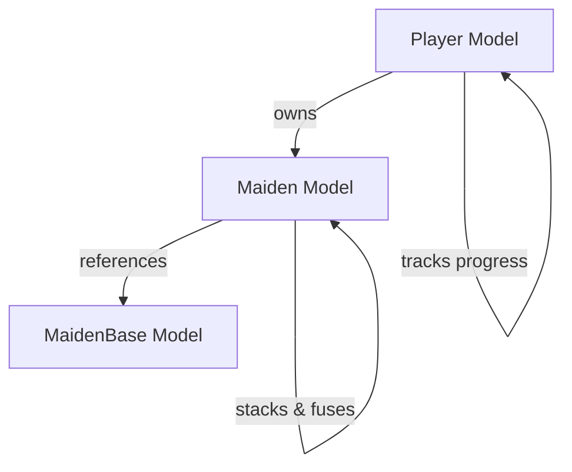

# RIKI Models & Services Architecture Guide

## 📊 **Model Overview & Relationships**



---

## 🎮 **Player Model**

### **Purpose**
The Player model is the **central entity** of RIKI. It represents a Discord user's complete game state, progression, and preferences. Every game action revolves around or modifies the Player record.

### **Core Responsibilities**
- **Identity Management**: Links Discord users to game accounts
- **Resource Tracking**: Manages energy, stamina, currencies (grace, rikies, shards)
- **Progression State**: Tracks level, experience, zone progress, achievements
- **Build Customization**: Stores skill point allocations (energy/stamina/attack/defense)
- **Tutorial Flow**: Manages onboarding state and progress
- **Activity Monitoring**: Timestamps for various game activities

### **Key Fields & Their Purpose**

```python
# Identity
discord_id: int          # Primary link to Discord user
username: str            # Cached Discord username

# Resources (regenerating)
energy: int             # For exploration/zones
stamina: int            # For combat/battles

# Currencies (permanent)
grace: int              # Summoning currency (from prayers)
rikies: int             # Primary currency (fusion, purchases)
rikishi_shards: int     # Premium currency (convenience)

# Strategic Build System
energy_investment: int   # Points → +5 max energy per point
stamina_investment: int  # Points → +5 max stamina per point
attack_investment: int   # Points → +10 attack per point
defense_investment: int  # Points → +10 defense per point
available_skill_points: int  # Unspent points (3 per level)

# Combat Power (cached from maiden collection)
total_attack: int       # Sum of all maiden attack
total_defense: int      # Sum of all maiden defense
total_power: int        # Combined power rating

# Progression
level: int              # Player level (0 = new, 1+ = active)
current_zone: int       # Current exploration zone
zone_progress: float    # 0.0 to 1.0 completion

# Tutorial System
onboarding_state: str   # not_started/in_progress/completed/skipped
current_tutorial_step: float  # 0.0 to 9.0 (supports 1.5, 2.0, etc.)
tutorial_progress_data: JSON  # Step-specific saved data

# Class System
player_class: str       # destroyer/adapter/invoker
```

---

## 👸 **Maiden Model**

### **Purpose**
The Maiden model represents **player-owned instances** of maidens. It implements RIKI's core "universal stacking" system where multiple copies of the same maiden at the same tier are stored as a quantity rather than individual records.

### **Core Responsibilities**
- **Ownership Tracking**: Links maidens to specific players
- **Stacking System**: Manages quantities for duplicate maiden/tier combinations
- **Fusion Progression**: Tracks tier advancement (1→6 for MVP, expandable to 12+)
- **Collection Management**: Handles acquisition, fusion, and consumption

### **Key Fields & Their Purpose**

```python
# Ownership
player_id: int          # Foreign key to players.discord_id
maiden_base_id: int     # Foreign key to maiden_bases.id

# Stacking & Progression
quantity: int           # Number of copies (can be 0 after fusion)
tier: int              # Current tier (1-6 MVP, 1-12+ future)

# Cached for Performance
element: str           # Copied from MaidenBase for query efficiency

# Tracking
fusion_count: int      # Times this stack has been fused
acquired_from: str     # summon/fusion/tutorial/event
```

### **Universal Stacking Logic**
```
Example: Player has 3x "Fire Sprite" at Tier 2
- Database stores: 1 record with quantity=3
- Fusion uses: 2x Tier 2 → 1x Tier 3 (quantity reduced by 2)
- If quantity reaches 0: Record kept for history
```

---

## 📜 **MaidenBase Model**

### **Purpose**
The MaidenBase model contains **static template definitions** for all maiden types. These are the blueprints that define a maiden's identity, stats, and visuals. They never change during gameplay.

### **Core Responsibilities**
- **Template Definition**: Master data for all maiden types
- **Base Statistics**: Starting combat values before tier scaling
- **Visual Assets**: Image URLs for Discord embeds
- **Element Assignment**: Defines maiden's elemental type

### **Key Fields & Their Purpose**

```python
# Identity
name: str              # Unique maiden name
element: str           # infernal/umbral/earth/tempest/radiant/abyssal

# Stats
base_tier: int         # Starting tier (usually 1)
base_atk: int          # Base attack value
base_def: int          # Base defense value

# Display
description: str       # Lore text for embeds
image_url: str        # Full artwork URL
portrait_url: str     # Thumbnail/icon URL
```

---

## 🔧 **Required Services & Their Responsibilities**

### **1. PlayerService**
**Purpose**: Manages all player-related operations and state changes

```python
class PlayerService:
    # Account Management
    async def get_or_create_player(discord_id: int, username: str) -> ServiceResult[Player]
    async def get_player_by_id(discord_id: int) -> ServiceResult[Player]
    
    # Progression
    async def grant_experience(player_id: int, amount: int) -> ServiceResult[Dict]
    async def grant_level_up(player_id: int, new_level: int) -> ServiceResult[Dict]
    
    # Skill Point System
    async def allocate_skill_points(
        player_id: int, 
        energy: int, 
        stamina: int, 
        attack: int, 
        defense: int
    ) -> ServiceResult[Dict]
    async def reset_skill_points(player_id: int) -> ServiceResult[Dict]  # Premium feature
    
    # Class System
    async def set_player_class(player_id: int, class_type: str) -> ServiceResult[Dict]
    async def get_class_bonuses(player_id: int) -> ServiceResult[Dict]
    
    # Combat Stats
    async def update_combat_stats(player_id: int) -> ServiceResult[Dict]
    async def calculate_total_power(player_id: int) -> ServiceResult[int]
```

### **2. ResourceService**
**Purpose**: Handles all currency and resource operations

```python
class ResourceService:
    # Grace Management
    async def add_grace(player_id: int, amount: int, context: str) -> ServiceResult[Dict]
    async def consume_grace(player_id: int, amount: int, context: str) -> ServiceResult[Dict]
    
    # Rikies Management
    async def add_rikies(player_id: int, amount: int, context: str) -> ServiceResult[Dict]
    async def consume_rikies(player_id: int, amount: int, context: str) -> ServiceResult[Dict]
    
    # Shards Management (Premium)
    async def add_shards(player_id: int, amount: int, context: str) -> ServiceResult[Dict]
    async def consume_shards(player_id: int, amount: int, context: str) -> ServiceResult[Dict]
    
    # Energy/Stamina
    async def regenerate_resources(player_id: int) -> ServiceResult[Dict]
    async def consume_energy(player_id: int, amount: int, context: str) -> ServiceResult[Dict]
    async def consume_stamina(player_id: int, amount: int, context: str) -> ServiceResult[Dict]
    
    # Validation
    async def validate_resource_cost(player_id: int, cost: Dict) -> ServiceResult[bool]
    async def get_regeneration_rates(player_id: int) -> ServiceResult[Dict]
```

### **3. MaidenService**
**Purpose**: Manages maiden collection, summoning, and ownership

```python
class MaidenService:
    # Summoning System
    async def execute_summon(player_id: int, grace_cost: int, quantity: int) -> ServiceResult[List[Maiden]]
    async def execute_tutorial_summon(player_id: int) -> ServiceResult[Maiden]  # Guaranteed Tier 2
    
    # Collection Management
    async def get_player_collection(player_id: int) -> ServiceResult[List[Maiden]]
    async def get_maiden_by_id(maiden_id: int) -> ServiceResult[Maiden]
    async def add_maiden_to_collection(
        player_id: int, 
        maiden_base_id: int, 
        tier: int, 
        quantity: int
    ) -> ServiceResult[Maiden]
    
    # Stacking Logic
    async def stack_or_create_maiden(
        player_id: int, 
        maiden_base_id: int, 
        tier: int
    ) -> ServiceResult[Maiden]
    
    # Power Calculation
    async def calculate_collection_power(player_id: int) -> ServiceResult[Dict]
    async def update_player_combat_stats(player_id: int) -> ServiceResult[Dict]
```

### **4. FusionService**
**Purpose**: Handles the 2→1 maiden fusion system

```python
class FusionService:
    # Fusion Discovery
    async def get_fusable_options(player_id: int) -> ServiceResult[Dict[int, List[Maiden]]]
    async def get_same_tier_options(
        player_id: int, 
        tier: int, 
        exclude_maiden_id: int
    ) -> ServiceResult[List[Maiden]]
    
    # Validation
    async def validate_fusion_requirements(
        player_id: int, 
        maiden1_id: int, 
        maiden2_id: int
    ) -> ServiceResult[Dict]
    
    # Execution
    async def execute_fusion(
        player_id: int, 
        maiden1_id: int, 
        maiden2_id: int
    ) -> ServiceResult[Dict]
    async def execute_tutorial_fusion(
        player_id: int, 
        maiden1_id: int, 
        maiden2_id: int
    ) -> ServiceResult[Dict]
    
    # Cost Calculation
    async def calculate_fusion_cost(tier: int) -> int
```

### **5. OnboardingService**
**Purpose**: Manages the tutorial flow and new player experience

```python
class OnboardingService:
    # Status Management
    async def get_onboarding_status(discord_id: int) -> OnboardingStatus
    async def start_onboarding(discord_id: int) -> ServiceResult[Player]
    
    # Tutorial Flow
    async def advance_step(
        discord_id: int, 
        step: float, 
        step_data: Dict
    ) -> ServiceResult[bool]
    async def save_tutorial_progress(discord_id: int, step_data: Dict) -> ServiceResult[bool]
    
    # Completion Paths
    async def skip_tutorial(discord_id: int, reason: str) -> ServiceResult[Dict]
    async def complete_tutorial(discord_id: int) -> ServiceResult[Dict]
    async def re_enable_tutorial(discord_id: int) -> ServiceResult[Dict]
```

### **6. PrayerService**
**Purpose**: Manages the grace generation mechanic

```python
class PrayerService:
    # Prayer Execution
    async def execute_prayer(player_id: int) -> ServiceResult[int]
    async def check_prayer_cooldown(player_id: int) -> ServiceResult[Dict]
    
    # Bonus Calculation
    async def get_prayer_bonus(player_id: int) -> int
    async def apply_class_bonus(player_id: int, base_grace: int) -> int
```

### **7. MaidenBaseService**
**Purpose**: Manages static maiden template data

```python
class MaidenBaseService:
    # Data Access
    async def get_maiden_base(maiden_base_id: int) -> ServiceResult[MaidenBase]
    async def get_all_maiden_bases() -> ServiceResult[List[MaidenBase]]
    async def get_maidens_by_element(element: str) -> ServiceResult[List[MaidenBase]]
    
    # Summoning Pools
    async def get_standard_pool() -> ServiceResult[List[MaidenBase]]
    async def get_weighted_random_maiden(tier: int = None) -> ServiceResult[MaidenBase]
```

---

## 🔄 **Service Interaction Flow Examples**

### **Example 1: Summoning a Maiden**
```python
# 1. PrayerService generates grace
grace = await PrayerService.execute_prayer(player_id)

# 2. ResourceService adds grace to player
await ResourceService.add_grace(player_id, grace, "prayer")

# 3. MaidenService executes summon
await ResourceService.consume_grace(player_id, 1, "summon")
maiden_base = await MaidenBaseService.get_weighted_random_maiden()
maiden = await MaidenService.stack_or_create_maiden(player_id, maiden_base.id, 1)

# 4. Update player stats
await MaidenService.update_player_combat_stats(player_id)
```

### **Example 2: Fusion Flow**
```python
# 1. FusionService validates requirements
validation = await FusionService.validate_fusion_requirements(player_id, m1_id, m2_id)

# 2. ResourceService handles payment
await ResourceService.consume_rikies(player_id, fusion_cost, "fusion")

# 3. MaidenService updates quantities
await MaidenService.reduce_quantity(m1_id, 2)  # Consume 2 maidens

# 4. MaidenService creates/stacks result
await MaidenService.stack_or_create_maiden(player_id, maiden_base_id, new_tier)

# 5. Update player stats
await MaidenService.update_player_combat_stats(player_id)
```

---

## 📊 **Database Query Patterns**

### **Common Query Needs**

```sql
-- Get player with full maiden collection
SELECT p.*, m.* 
FROM players p
LEFT JOIN maidens m ON m.player_id = p.discord_id
WHERE p.discord_id = ?;

-- Find fusable maidens
SELECT * FROM maidens
WHERE player_id = ? 
  AND tier = ?
  AND quantity >= 2;

-- Calculate total player power
SELECT SUM((mb.base_atk + mb.base_def) * (1 + (m.tier - 1) * 0.2) * m.quantity) as total_power
FROM maidens m
JOIN maiden_bases mb ON m.maiden_base_id = mb.id
WHERE m.player_id = ?;

-- Get maiden with base data
SELECT m.*, mb.*
FROM maidens m
JOIN maiden_bases mb ON m.maiden_base_id = mb.id
WHERE m.id = ?;
```

---

## 🎯 **Implementation Priority**

### **Phase 1: Core Foundation**
1. **PlayerService** - Account creation and management
2. **ResourceService** - Currency and resource handling
3. **MaidenBaseService** - Load static maiden data

### **Phase 2: Collection System**
4. **MaidenService** - Collection management
5. **PrayerService** - Grace generation
6. **FusionService** - Maiden combination

### **Phase 3: Tutorial**
7. **OnboardingService** - New player experience

### **Phase 4: Extended Features**
- CombatService
- ZoneService
- AchievementService
- EventService

---

## 🔐 **Critical Implementation Rules**

1. **All state changes through services** - Never modify models directly
2. **Use transactions with pessimistic locking** - Prevent race conditions
3. **Log all resource changes** - Complete audit trail
4. **Cache calculations** - Don't recalculate power on every request
5. **Validate at service level** - Not in models or commands
6. **Event publishing for complex flows** - Decouple service dependencies

This architecture ensures RIKI maintains data integrity, scales efficiently, and provides a clean separation of concerns across all game systems.